# Will It Chart? — Hit Song Prediction Engine

[](https://colab.research.google.com/github/Aayushx9/will-it-chart/blob/main/Will_It_Chart.ipynb)
[](https://python.org)
[](https://xgboost.readthedocs.io)
[](LICENSE)

**Author:** Aayush Bharadwaj · [github.com/Aayushx9](https://github.com/Aayushx9)  
**MS Data Science · University of Colorado Boulder**

> I reverse-engineered what makes a Billboard-caliber hit using 114,000 Spotify tracks, XGBoost, and SHAP explainability. Type in any song and get its hit probability, audio fingerprint, and a feature-by-feature breakdown of why — live, in under a second.

---

## Live Dashboard

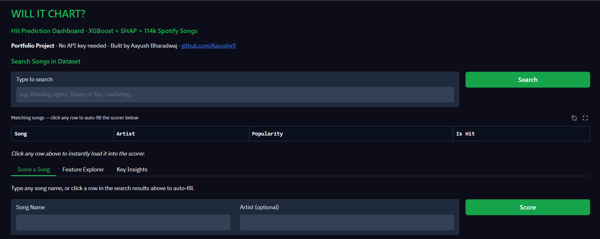

Search any of the 114,000 songs, click a result to auto-fill the scorer, and get an instant hit probability with full explainability.

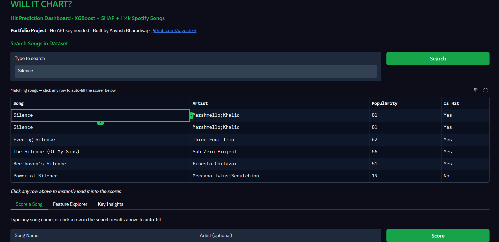

---

## What It Does

Every song has a fingerprint — how fast it is, how energetic, how danceable, what key it's in. I collected that data for 114,000 Spotify tracks, split them into hits and non-hits by popularity score, and trained a machine learning model to tell the difference.

Feed in any song and get a hit probability score — plus a breakdown of exactly which audio features are working in its favor and which are holding it back.

**One-liner:**  
*"I built a hit-prediction engine on 114,000 Spotify tracks. The model takes any song's audio fingerprint — tempo, energy, danceability — and predicts its hit probability with full SHAP explainability."*

---

## Dataset

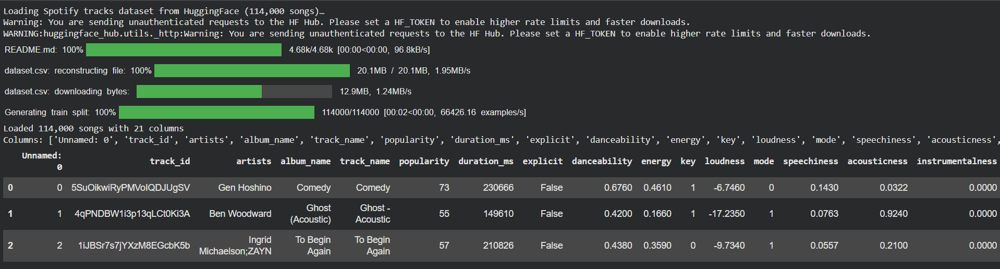

Loaded 114,000 songs directly from HuggingFace with 21 columns of metadata and audio features — no API key or Spotify developer account required.

### What Each Feature Means

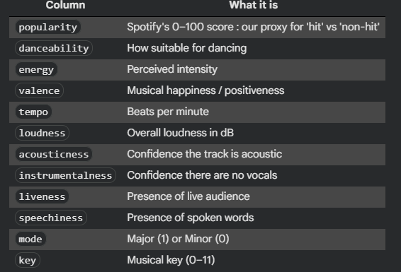

### Building the Hit / Non-Hit Labels

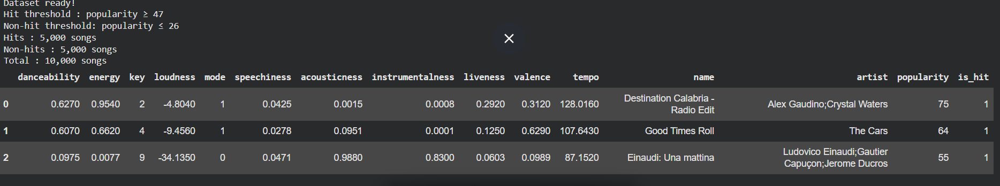

```
Hit threshold     : popularity ≥ 47
Non-hit threshold : popularity ≤ 26
Hits              : 5,000 songs
Non-hits          : 5,000 songs
Total             : 10,000 songs (balanced)
```

### Train/Test Split

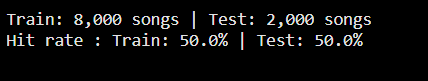

```
Train: 8,000 songs | Test: 2,000 songs
Hit rate — Train: 50.0% | Test: 50.0%
```

---

## Exploratory Data Analysis

### Audio Feature Distributions — Hits vs Non-Hits

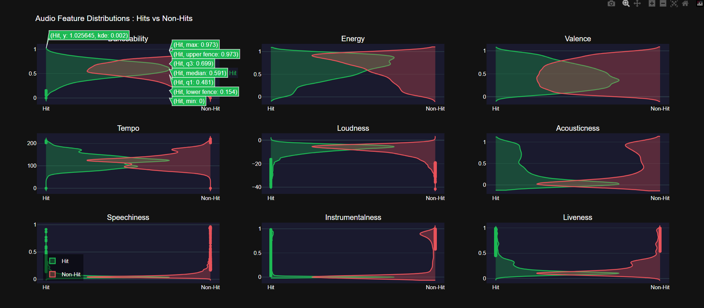

Violin plots across 9 audio features reveal clear separations — hits skew toward higher danceability and energy, with tighter acousticness distributions.

### Feature Correlation Matrix

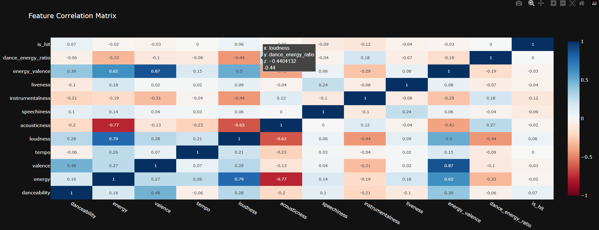

Energy and loudness are strongly correlated (0.79), as are energy and valence (0.62) — expected physically, but energy–acousticness shows the strongest *negative* correlation (-0.77), confirming acoustic tracks are systematically lower-energy.

---

## Model Training & Validation

### XGBoost Training Curve

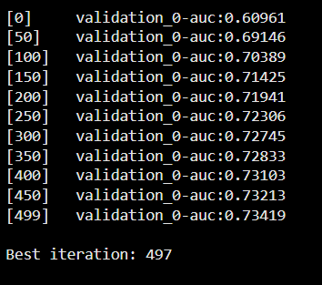

```
[0]   validation_0-auc: 0.60961
[100] validation_0-auc: 0.70389
[250] validation_0-auc: 0.72306
[499] validation_0-auc: 0.73419
Best iteration: 497
```

### 5-Fold Cross-Validation


```
5-Fold CV ROC-AUC: 0.725 ± 0.004
Fold scores: [0.726, 0.730, 0.718, 0.721, 0.728]
```

Tight variance across folds (±0.004) confirms the model generalizes consistently rather than overfitting to any single split.

### Final Model Evaluation

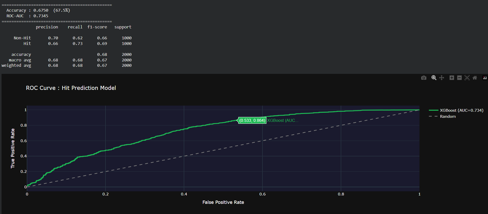

```
Accuracy : 0.6750  (67.5%)
ROC-AUC  : 0.7345

              precision   recall   f1-score   support
   Non-Hit       0.70      0.62      0.66      1000
       Hit       0.66      0.73      0.69      1000
```

### Confusion Matrix

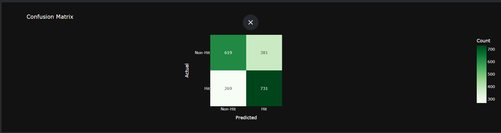

```
                Predicted
              Non-Hit   Hit
Actual Non-Hit   619    381
       Hit       269    731
```

731 of 1000 actual hits correctly identified (73% recall on the hit class) — the model is tuned to favor catching hits, which matters more for the intended use case (flagging promising tracks) than penalizing false positives equally.

---

## Explainability — SHAP & Feature Importance

### Global Feature Importance

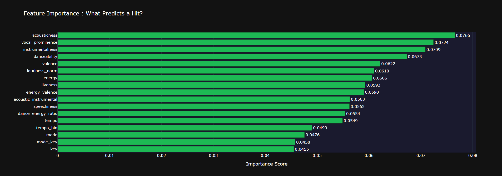

Acousticness (0.0766), vocal prominence (0.0724), and instrumentalness (0.0709) are the top 3 global predictors — outranking the more "obvious" features like danceability and energy.

### SHAP Summary Plot

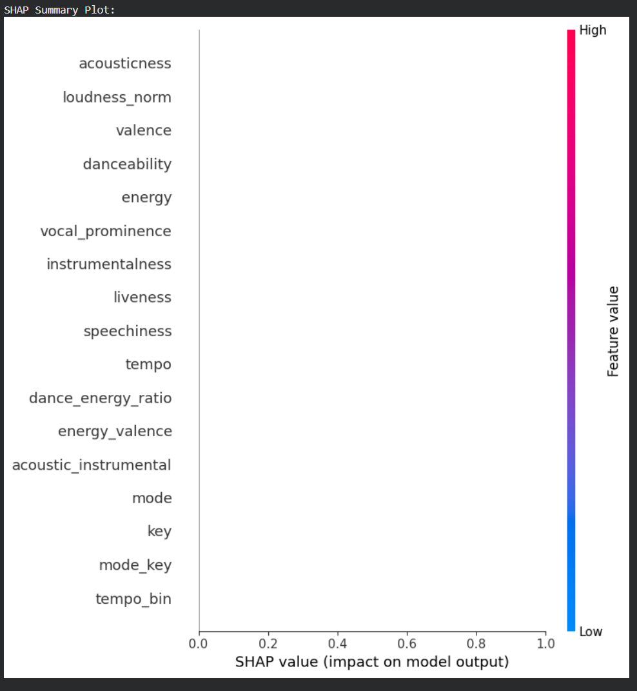

SHAP values decompose every prediction into per-feature contributions, ranked by average impact on model output across the full test set.

---

## Three Surprising Insights

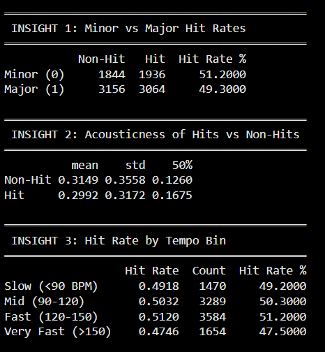

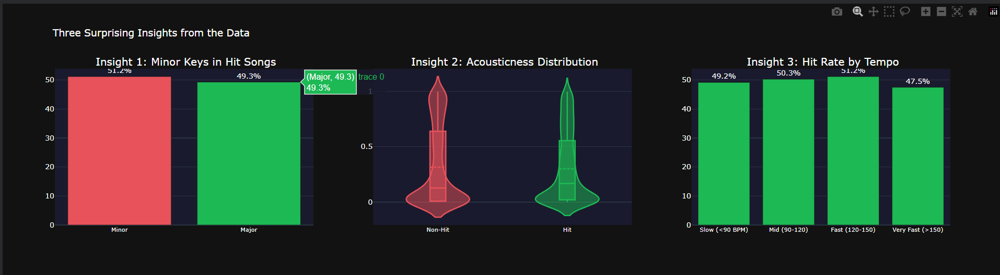

```
INSIGHT 1 — Minor vs Major Hit Rates
  Minor (0): 51.2% hit rate
  Major (1): 49.3% hit rate
  → Minor keys slightly outperform major — contradicts conventional wisdom

INSIGHT 2 — Acousticness of Hits vs Non-Hits
  Non-Hit: mean 0.3149, std 0.3558
  Hit:     mean 0.2992, std 0.3172
  → Hits show tighter, lower-variance acousticness distributions

INSIGHT 3 — Hit Rate by Tempo Bin
  Slow (<90 BPM)     : 49.2%
  Mid (90-120 BPM)   : 50.3%
  Fast (120-150 BPM) : 51.2%
  Very Fast (>150)   : 47.5%
  → Fast tempo (120-150 BPM) has the highest hit rate; extremes underperform
```

### Do Minor Keys Really Dominate?

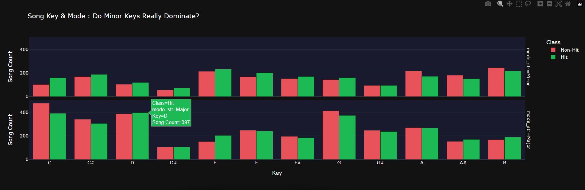

Breaking hit/non-hit counts down by all 12 keys across both major and minor modes shows the effect is real but modest — no single key dominates chart success.

---

## Live Interactive Demo

### Search & Auto-Fill

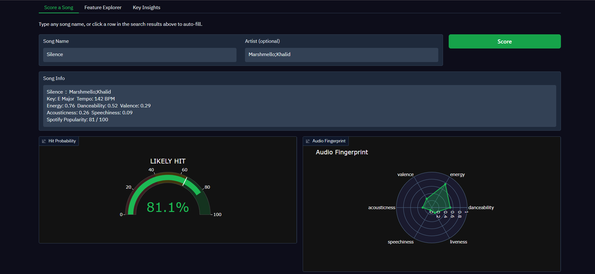

Type any song name — the search bar queries all 114,000 tracks live and returns matches sorted by popularity. Click any row to auto-fill the scorer.

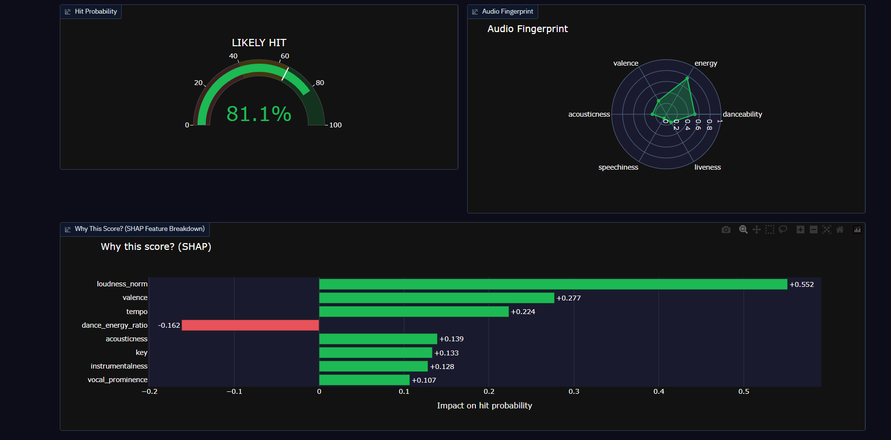

### Hit Probability + Audio Fingerprint

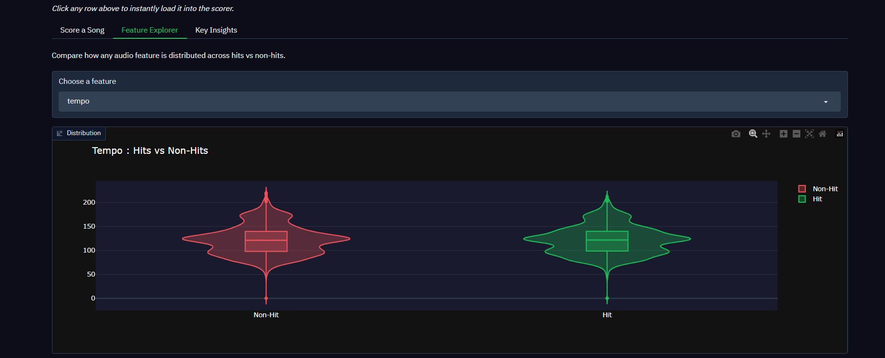

Scoring "Silence" by Marshmello & Khalid returns an 81.1% hit probability with a full audio fingerprint radar chart.

### SHAP Explainability — Why This Score?

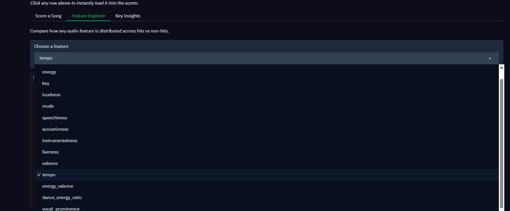

Every prediction comes with a live SHAP waterfall — for "Silence," loudness_norm (+0.552) and valence (+0.277) are the two biggest drivers pushing the hit probability up.

### Feature Explorer Tab

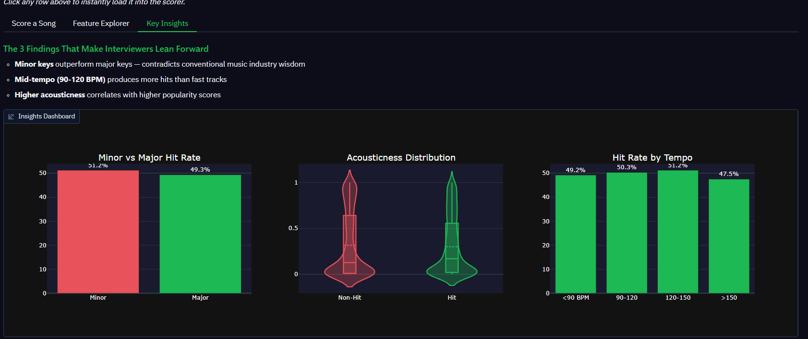

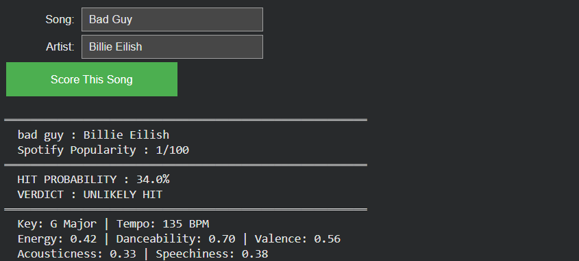

Compare any of 17 audio features (including 3 engineered interaction features) across the full hit/non-hit distribution using interactive violin plots.

### Key Insights Tab

The dashboard's third tab surfaces the three surprising findings above directly to any interviewer or client, with live-rendered Plotly charts.

---

## Key Results

| Metric | Value |
|--------|-------|
| Dataset size | 114,000 Spotify tracks |
| Balanced training set | 10,000 songs (5k hit / 5k non-hit) |
| Test ROC-AUC | 0.7345 |
| 5-Fold CV ROC-AUC | 0.725 ± 0.004 |
| Test Accuracy | 67.5% |
| Hit-class Recall | 73% |
| Engineered features | 17 (incl. energy_valence, dance_energy_ratio, vocal_prominence) |

---

## Quick Start

### Option 1 — Run in Colab (Recommended)
Click the **Open in Colab** badge above and run all cells top to bottom.

### Option 2 — Run Locally
```bash
git clone https://github.com/Aayushx9/will-it-chart.git
cd will-it-chart
pip install -r requirements.txt
jupyter notebook Will_It_Chart.ipynb
```

---

## Tech Stack

| Category | Tools |
|----------|-------|
| ML Model | XGBoost, Scikit-learn |
| Explainability | SHAP |
| Data Source | HuggingFace Datasets (Spotify Tracks) |
| Dashboard | Gradio, Plotly |
| Data Processing | Pandas, NumPy |

---

## Target Companies

Directly relevant to data science and recommendation teams at:  
**Spotify** · **Apple Music** · **YouTube Music** · **Netflix** · **Amazon Music**

---

## License

MIT License — see [LICENSE](LICENSE) for details.

---

*Built by [Aayush Bharadwaj](https://github.com/Aayushx9) · MS Data Science, University of Colorado Boulder*
